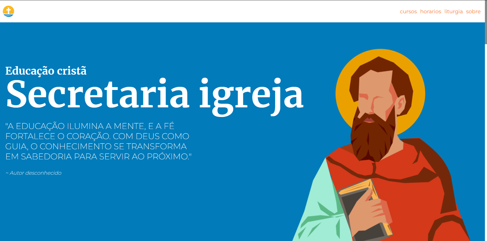

# II - projeto extensão faculdade 📖



> Iniciei uma das disciplinas mais importantes do meu curso: "II Projeto de Extensão". Esse projeto faz parte do Programa de Ação e Difusão Cultural do Curso Superior de Tecnologia em Análise e Desenvolvimento de Sistemas e tem como objetivo aplicar os conhecimentos de tecnologia da informação para apoiar pessoas e grupos ligados a atividades culturais.

## Requisitos 💻

Antes de clonar o projeto e recomendado você ter os seguintes requisitos:

### BACKEND 🌑

-   Necessario ter `python3+` instalado
-   Requisito `git` para clonar
-   Sua maquina `Windows, Linux ou Mac`.
-   Conhecimento basico `flask`

### FRONTEND ☀️

-   Necessario ter `Node.Js` instalado
-   Importar bibliotecas como `Vite`
-   Conhecimento basico `Typescript`

## Tecnologias 🚀

As principais tecnologias e ferramentas utilizadas neste projeto são:

-   `Flask`: um framework web minimalista para Python, focado na simplicidade e flexibilidade. Ele permite criar aplicações web rapidamente sem a complexidade de frameworks mais robustos, como Django.

-   `React + Ts`: uma biblioteca JavaScript para construção de interfaces de usuário, desenvolvida pelo Facebook. Ele é amplamente utilizado para criar aplicações web interativas de forma eficiente e escalável. Já o TypeScript uma linguagem que se baseia em JavaScript, mas adiciona tipagem estática e outros recursos, como interfaces, classes e módulos. Ele compila para JavaScript, mas oferece uma série de benefícios durante o desenvolvimento, como a detecção de erros em tempo de compilação. Quando você usa React com TypeScript (React TS), você está combinando o poder do React para construir UIs com as vantagens da tipagem estática de TypeScript.

## Como instalar 🚀

Windows, Linux e macOS

```
git clone https://github.com/danielBRTanimacao/II-projeto-extensao-faculdade.git
cd II-projeto-extensao-faculdade

npm i
npm run dev
```

Por padrão o projeto vem com uma simples API no backend que pode ser modificado dentro dos arquivs `src` do projeto.

```
cd backend
python -m venv venv

venv/scripts/activate
pip install -r requirements.txt

run main.py
```

Dentro do backend do projeto e necessario criar os JSONs `courses.json` e o `events.json` para modificar a api e diretamente no main

### Contato 📞

-   Nome: Daniel Tenório
-   Email: danieltenorio2046@gmail.com
-   LinkedIn: [Meu LinkedIn](https://www.linkedin.com/in/daniel-tenório-6471b0244/)
